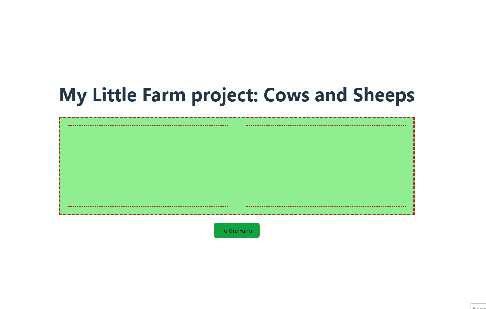

# 🐄 My Little Farm

My Little Farm is a small React-based interactive app, where cows and sheep switch sides in a pasture. It's built using state management, `localStorage`, and dynamic rendering logic.

---

## ✨ Features

- 🐑 Cows on the left, sheep on the right
- 🖱 Click an animal to move it to the other side
- 💾 Animal state is saved to `localStorage`
- 🎨 Simple, colorful UI with shapes
- 🔢 Unique ID generated for every animal

---
## 📸 Preview



---
## 🛠️ Built with

- React
- Vite
- JavaScript
- CSS

---
📚 What I learned: 

- React state management with useState

- Generating random data (IDs, animal count)

- Event handling and filtering

- Data persistence with localStorage

---
## 🚀 How to run locally

```bash
npm install
npm run dev


